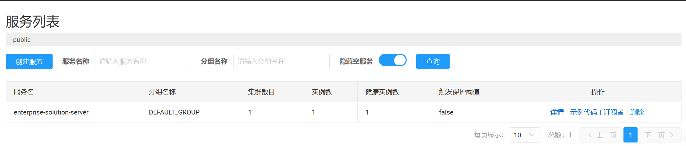
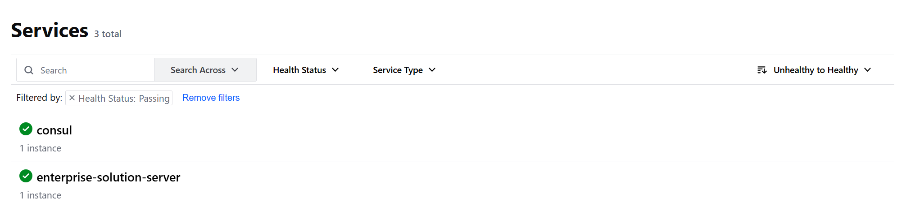
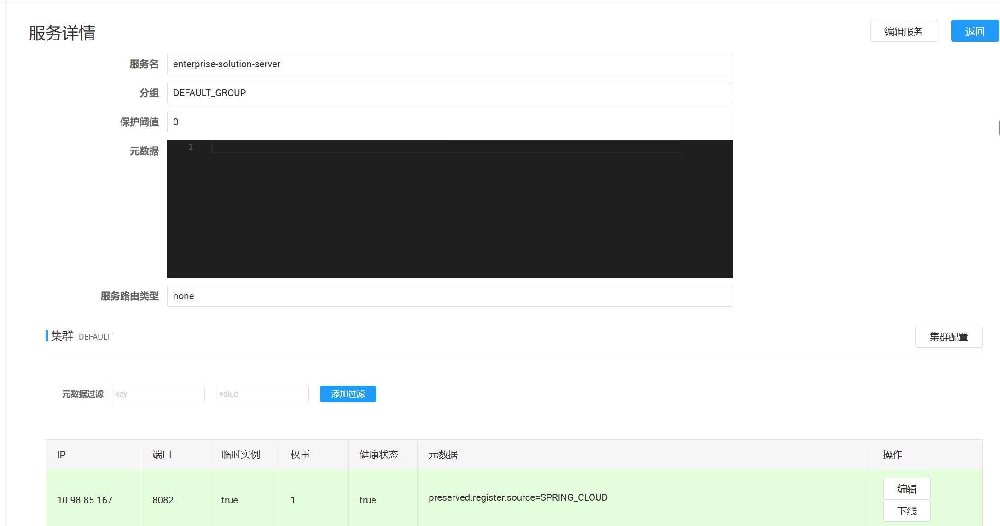
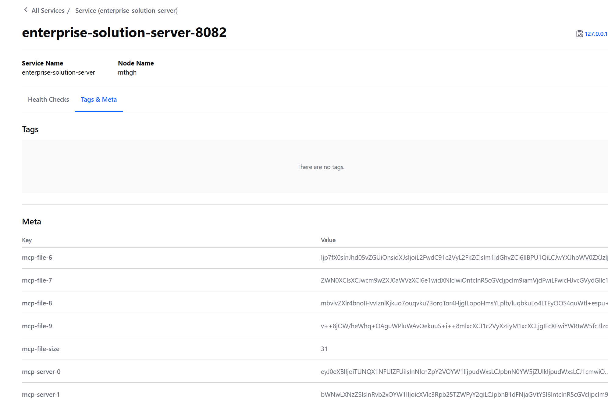

# Enterprise Solution 示例

# [中文](README.md) | [English](README_EN.md)

## 项目概述

Enterprise Solution 是一个**企业级 MCP 解决方案**，集成了之前所有示例项目的核心功能。该项目提供了完整的 REST to MCP 转换、多注册中心支持、MCP 服务注册等能力，是企业级 AI 应用集成的综合解决方案。
本示例使用 Nacos 作为第一个注册中心，Consul 作为第二个注册中心（MCP 元数据发布目标），通过配置文件中的集中配置实现双注册中心的无缝集成。

## 🚀 核心特性

### 🔄 全链路 MCP 转换与注册
- **REST to MCP 自动转换**：将现有 REST API 无缝转换为 MCP 工具
- **MCP 服务自动注册**：将转换后的 MCP 工具和 MCP Server 都注册到服务注册中心
- **双协议并行支持**：同时支持 MCP 协议和 HTTP REST 协议调用

### 🌐 多注册中心支持
- **四注册中心支持**：Nacos、Eureka、Consul、Zookeeper
- **双注册中心并行**：支持同时向两个不同注册中心注册服务
- **配置文件统一管理**：在配置文件中集中管理所有注册中心配置，无需额外的注册中心管理服务

### 🛠️ 企业级特性
- **服务治理集成**：完整的服务发现、元数据发布
- **编译时元数据生成**：AI 增强的自然语言描述，增量更新机制
- **类型安全调用**：基于 JSON Schema 的完整类型安全保证

## 依赖说明

### 📦 [metadata-compile](..%2Fmetadata-compile)（演示项目共用）

**重要说明**：此依赖仅用于演示项目的代码共享，在实际项目中您不需要依赖此模块。

- **演示用途**：为了避免在多个演示项目中重复编写相同的 UserController 代码
- **实际使用**：在您自己的项目中，可以直接配置 MCP 注解处理器来生成您自己的 REST Controller 元数据
- **生成原理**：通过 Maven 编译器插件分析您的 REST Controller 自动生成元数据

```xml
<dependencies>
    <dependency>
        <groupId>io.github.xiaozhug</groupId>
        <artifactId>metadata-compile-jdk17</artifactId>
    </dependency>
    
    <!-- MCP 核心注册与发现 -->
    <dependency>
        <groupId>io.github.xiaozhug</groupId>
        <artifactId>ai-mcp-bridge-spring-boot-mcp-registry-starter</artifactId>
    </dependency>

    <!-- MCP 元数据文件暴露 -->
    <dependency>
        <groupId>io.github.xiaozhug</groupId>
        <artifactId>ai-mcp-bridge-spring-boot-mcp-file-expose-starter</artifactId>
    </dependency>

    <!-- MCP 服务器暴露支持 -->
    <dependency>
        <groupId>io.github.xiaozhug</groupId>
        <artifactId>ai-mcp-bridge-spring-boot-mcp-server-expose-starter</artifactId>
    </dependency>

    <!-- 注册中心客户端（支持多种注册中心） -->
    <dependency>
        <groupId>com.alibaba.cloud</groupId>
        <artifactId>spring-cloud-starter-alibaba-nacos-discovery</artifactId>
    </dependency>

    <dependency>
        <groupId>org.springframework.cloud</groupId>
        <artifactId>spring-cloud-starter-consul-discovery</artifactId>
    </dependency>

    <!-- 健康检查支持 -->
    <dependency>
        <groupId>org.springframework.boot</groupId>
        <artifactId>spring-boot-starter-actuator</artifactId>
    </dependency>

</dependencies>
```

### 客户端 Maven 依赖配置

```xml
<dependencies>
    <!-- MCP 服务注册启动器 -->
    <dependency>
        <groupId>io.github.xiaozhug</groupId>
        <artifactId>ai-mcp-bridge-spring-boot-mcp-registry-starter</artifactId>
    </dependency>

    <!-- MCP 客户端启动器 -->
    <dependency>
        <groupId>io.github.xiaozhug</groupId>
        <artifactId>ai-mcp-bridge-spring-boot-mcp-client-starter</artifactId>
    </dependency>

    <!-- 注册中心客户端（支持多种注册中心） -->
    <dependency>
        <groupId>com.alibaba.cloud</groupId>
        <artifactId>spring-cloud-starter-alibaba-nacos-discovery</artifactId>
    </dependency>

    <dependency>
        <groupId>org.springframework.cloud</groupId>
        <artifactId>spring-cloud-starter-consul-discovery</artifactId>
    </dependency>
</dependencies>
```

## 🔧 功能模块详解

### 1. REST to MCP 转换模块

**功能说明**：将现有的 [REST Controller](..%2Fmetadata-compile%2Fmetadata-compile-jdk17) 自动转换为 MCP 工具，无需修改现有代码。

**核心特性**：
- **零代码侵入式转换**：无需修改现有 REST Controller，自动转换为 MCP 工具
- **自动生成 MCP 工具定义**：为每个 REST 方法创建对应的 MCP 工具定义
- **JSON Schema 自动生成**：基于方法参数自动生成完整的 JSON Schema
- **完整的类型安全调用**：支持参数类型检查和验证，确保调用安全

### 2. 标准 MCP Server 模块

**功能说明**：使用标准的 Spring AI `@Tool` 注解直接定义 MCP 工具 [MianshiyaService.java](enterprise-solution-server%2Fsrc%2Fmain%2Fjava%2Fio%2Fxiaozhug%2Fdemo%2Fenterprise%2Fmcpserver%2Fservice%2FMianshiyaService.java)。

**核心特性**：
- **标准 MCP 工具定义**：使用 Spring AI `@Tool` 注解直接定义 MCP 工具
- **完整的工具描述**：支持详细的工具描述和参数说明
- **灵活的参数处理**：支持各种参数类型和复杂数据结构
- **与 REST 转换并存**：可以与 REST to MCP 转换模块同时使用

### 3. MCP 服务注册模块

**功能说明**：将 MCP 工具和 MCP Server 自动注册到配置的服务注册中心，支持多注册中心并行注册。

**核心特性**：
- **自动服务注册**：将 MCP 工具和 MCP Server 自动注册到配置的服务注册中心
- **多注册中心并行注册**：支持同时向多个注册中心注册服务实例
- **完整的服务发现**：提供服务发现能力，支持客户端自动发现可用工具
- **元数据发布**：在服务实例中发布完整的 MCP 工具和 MCP Server 元数据信息

### 4. 多注册中心配置模块

**功能说明**：通过配置文件管理多个注册中心的连接和注册过程，无需额外的智能管理组件。

**核心特性**：
- **配置文件统一管理**：所有注册中心配置在application.yaml中集中管理，简化运维复杂度
- **配置冲突避免**：采用分离式配置设计，避免相同注册中心的配置冲突
- **双注册中心并行**：支持同时向两个不同的注册中心注册服务，通过配置文件手动指定

## 快速开始

### 服务端配置与启动

1. **服务端配置文件 (application.yaml)**

```yaml
server:
  port: 8082

spring:
  application:
    name: enterprise-solution-server

  cloud:
    nacos:
      discovery:
        # 第一个注册中心（主注册中心）
        server-addr: 127.0.0.1:8848
    consul:
      enabled: false
      host: 127.0.0.1
      port: 8500
      discovery:
        hostname: 127.0.0.1

# MCP 配置
mcp:
  # 指定第二个注册中心（MCP 元数据将发布到此注册中心）
  # 可选值: eureka, nacos, consul, zookeeper
  registry: consul

# 面试鸭 API 配置（MianshiyaService 使用）
endpoint:
  mianshiya:
    searchQuestion: https://api.mianshiya.com/api/question/mcp/search
    resultLink: https://www.mianshiya.com/question/%s
```

2. **启动服务端**

### 客户端配置与使用

1. **客户端配置文件 (application.yaml)**

```yaml
server:
  port: 8081

spring:
  application:
    name: enterprise-solution-client
  ai:
    openai:
      api-key: your-api-key
      chat:
        options:
          model: your-model-name
      base-url: your-openai-base-url

  cloud:
    nacos:
      discovery:
        # 第一个注册中心（主注册中心）
        server-addr: 127.0.0.1:8848
    consul:
      enabled: false
      host: 127.0.0.1
      port: 8500
      discovery:
        hostname: 127.0.0.1

    # 服务发现核心配置（必须启用）
    discovery:
      fetch:
        enabled: true

# MCP 配置
mcp:
  # 指定要连接的 MCP 注册中心
  registry: consul
```

2. **客户端使用示例 [EnterpriseSolutionClientApplication.java](enterprise-solution-client%2Fsrc%2Fmain%2Fjava%2Fio%2Fxiaozhug%2Fdemo%2Fenterprise%2FEnterpriseSolutionClientApplication.java)**

## 工作机制

### 配置加载阶段
- 应用启动时自动加载所有预配置的注册中心配置
- 解析 `mcp.registry` 参数确定 MCP 元数据发布的目标注册中心

### 自动检测阶段
- 系统读取 `mcp.registry` 配置指定的注册中心类型
- 验证对应注册中心的配置完整性和有效性
- 加载对应的 `application-mcp-{registry}.yaml` 配置文件

### 服务注册阶段
- 向主注册中心注册基础服务信息
- 向 `mcp.registry` 指定的注册中心注册服务并发布 MCP 元数据
- 客户端通过 `spring.cloud.discovery.fetch.enabled=true` 配置自动发现 MCP 工具

### MCP 工具发现与调用阶段
- 客户端启动时自动连接到配置的注册中心
- 通过服务发现机制获取可用的 MCP 工具列表
- 根据工具元数据构建调用请求
- 发送请求到对应的服务实例并处理响应

## 验证结果

### ✅ 服务注册验证
成功启动后，在两个注册中心控制台都可以观察到：

- **服务名称**：`enterprise-solution-server`
- **实例状态**：`UP`
- **注册状态**：双注册中心均成功注册




### ✅ MCP 工具元数据验证

#### 主注册中心（无 MCP 元数据）
在第一个注册中心中，**仅包含标准的服务注册信息，不包含任何 MCP 特定元数据**，保持完全的向后兼容性。



#### MCP 注册中心（包含完整元数据）
在 `mcp.registry` 配置指定的注册中心中，可以看到完整的 MCP 工具元数据：



**说明**：
- `<mcp-file-size>` 值表示元数据分片数量，通常大于 0
- 当元数据较大时，会自动分片存储，生成 `<mcp-file-0>`、`<mcp-file-1>` 等多个分片
- 客户端会自动合并所有分片，还原完整的 MCP 工具元数据

#### 注意事项（Nacos 元数据长度限制）
如果使用 Nacos 作为 MCP 注册中心，需要注意 Nacos 默认对元数据长度有一定限制。当 MCP 工具元数据较大时，可能需要调整 Nacos 服务端配置：

```bash
# 在 Nacos 服务端环境变量中设置
export NACOS_NAMING_SERVICE_METADATA_LENGTH=20480  # 示例：设置为20KB

# 或在 Nacos 配置文件中设置
nacos.naming.service.metadata.length=20480
```

## 应用场景

### 🔄 企业级 MCP 部署

- **统一服务治理**：集中管理所有 MCP 工具的注册和发现
- **多协议支持**：同时支持 MCP 协议和 HTTP REST 协议，满足不同场景需求
- **灵活部署策略**：支持多种注册中心组合，适应不同的企业技术栈

### 🧪 混合 MCP 工具开发

- **渐进式迁移**：现有 REST API 无需修改即可转为 MCP 工具
- **标准 MCP 开发**：同时支持使用标准 `@Tool` 注解直接开发 MCP 工具
- **统一管理**：两种方式开发的 MCP 工具统一注册和管理

### 🌐 大规模服务集成

- **服务隔离优化**：客户端的 MCP 工具只会从 MCP 注册中心拉取，避免拉取无用服务；同时主注册中心也不会拉取 MCP 注册中心的服务，实现了服务发现的精准隔离
- **统一的工具发现**：客户端通过统一的接口发现和调用所有 MCP 工具
- **完整的类型安全**：基于 JSON Schema 的类型检查，确保调用安全

## 优势总结

- **功能完整性**：集成了所有核心功能，提供一站式 MCP 解决方案
- **灵活性**：支持多种注册中心组合，适应不同技术栈
- **兼容性**：确保新旧系统无缝衔接，降低迁移成本
- **可扩展性**：易于扩展支持更多注册中心类型和工具类型

## 重要依赖配置说明

### ⚠️ 关键依赖位置要求

**`ai-mcp-bridge-spring-boot-mcp-registry-starter` 依赖必须在 pom.xml 中靠前声明**

```xml
<dependencies>
    <!-- 必须靠前声明：MCP 服务注册启动器 -->
    <dependency>
        <groupId>io.github.xiaozhug</groupId>
        <artifactId>ai-mcp-bridge-spring-boot-mcp-registry-starter</artifactId>
    </dependency>
    <!-- 其他依赖... -->
</dependencies>
```

# 🔧 关键依赖位置要求的原因详解

## 📝 背景：Spring 父子容器机制的挑战

在实现 Spring 父子容器机制来支持双注册中心时，我面临一个关键的技术挑战：

### 问题描述
- **需求**：在子容器中需要忽略 `@ConditionalOnMissingBean` 注解的某些功能
- **挑战**：Spring Boot 框架本身没有提供合适的扩展点来修改这个行为
- **场景**：当 `@ConditionalOnMissingBean(search = SearchStrategyALL)` 在子容器中执行时，它会搜索父容器中的 Bean，导致父子容器间的 Bean 定义冲突
  这正是我们复制并增强 SpringBootCondition 类并要求依赖顺序优先的根本原因。这种解决方案虽然不完美，但在当前技术约束下是实现双注册中心功能的必要手段。

### 技术分析
Spring 的条件注解机制在父子容器环境下存在设计限制，需要通过自定义扩展来解决跨容器 Bean 查找的问题。

### 解决方案
这正是我们复制并增强 SpringBootCondition 类并要求依赖顺序优先的根本原因。

## 总结

**enterprise-solution** 示例工程是 AI MCP Bridge 的企业级综合解决方案，集成了 REST to MCP 转换、标准 MCP Server 开发、多注册中心支持等所有核心功能。

该示例通过配置文件中的集中配置实现双注册中心的无缝集成，支持同时使用 REST Controller 自动转换和标准 `@Tool` 注解直接开发两种方式创建 MCP 工具，为企业级 AI 应用集成提供了完整的技术支持。
