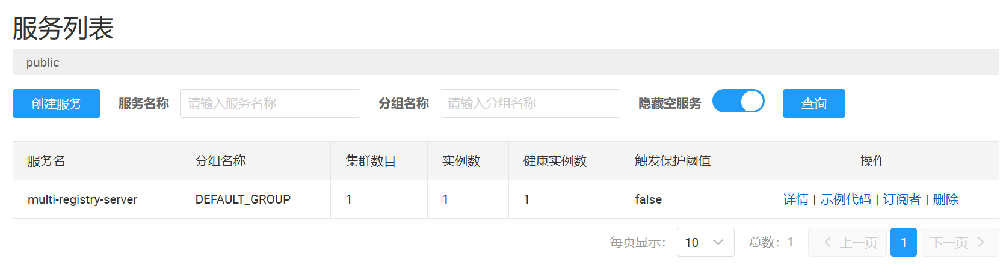
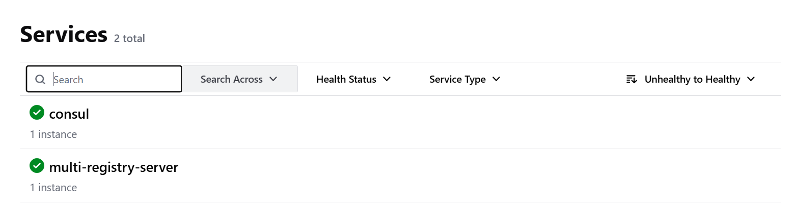
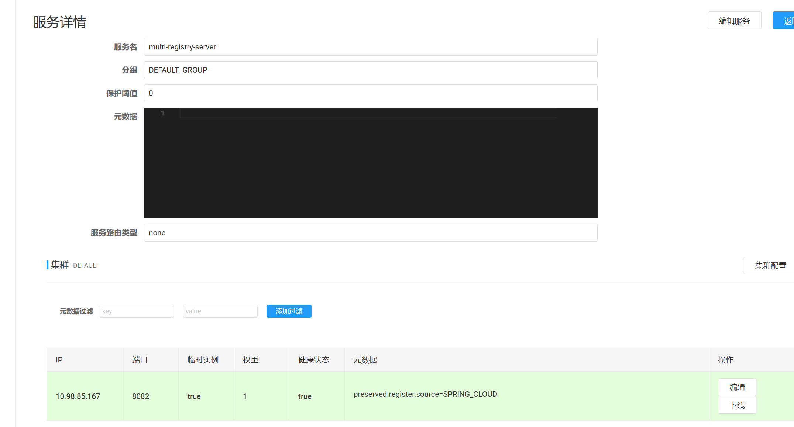
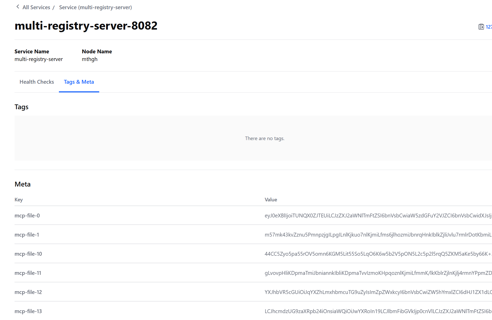

# Multi Registry Example

# [中文](README.md) | [English](README_EN.md)

## Project Introduction

This is an example project demonstrating how to **register MCP tools to two different service registries simultaneously**. This example uses Nacos as the first registry and Consul as the second registry (target for MCP metadata publishing), achieving seamless integration of dual registries through centralized configuration in the configuration file.

## Core Features

### 🌐 Dual Registry Support
- **Centralized Configuration Management**: All registry configurations are centrally managed in configuration files, simplifying operations
- **Flexible Configuration Selection**: Specify the second registry through the \`mcp.registry\` configuration
- **Configuration Conflict Avoidance**: Uses separated configuration design to effectively avoid configuration conflicts with the same registry

### 🔧 Configuration Management
- **One-stop Configuration**: All registry configurations are centrally managed in the main configuration file
- **Conditional Enablement**: Flexibly specify the enabled second registry through the \`mcp.registry\` parameter
- **Separated Configuration**: Uses independent configuration files to manage detailed configurations of different registries

### 🚀 Automatic Registration Mechanism
- **Dual Registry Parallel Operation**: Supports registering services to two different registries simultaneously
- **Complete Metadata Publishing**: Publishes detailed MCP tool information in service instances
- **Service Discovery Support**: Integrates \`spring.cloud.discovery.fetch.enabled=true\` configuration to achieve automatic discovery of MCP tools by clients

## Dependencies Description

### 📦 [metadata-compile](..%2Fmetadata-compile) (Shared by demo projects)

**Important Note**: This dependency is only used for code sharing between demo projects. In actual projects, you do not need to depend on this module.

- **Demonstration Purpose**: To avoid duplicating the same UserController code across multiple demo projects
- **Actual Usage**: In your own projects, you can directly configure the MCP annotation processor to generate metadata for your own REST Controllers
- **Generation Principle**: Automatically generates metadata by analyzing your REST Controllers through the Maven compiler plugin

### Server Dependencies

```xml
<dependencies>
<!-- Metadata Generation (Shared by demo projects) -->
    <dependency>
        <groupId>io.github.xiaozhug</groupId>
        <artifactId>metadata-compile-jdk8</artifactId>
    </dependency>

    <!-- MCP Service Registration Starter (Core Dependency) -->
    <dependency>
        <groupId>io.xiaozhug</groupId>
        <artifactId>ai-mcp-bridge-spring-boot-mcp-registry-starter</artifactId>
    </dependency>

    <!-- MCP Metadata Exposure Support (Core Dependency) -->
    <dependency>
        <groupId>io.xiaozhug</groupId>
        <artifactId>ai-mcp-bridge-spring-boot-mcp-file-expose-starter</artifactId>
    </dependency>

    <!-- Registry Clients (Supporting Multiple Registries) -->
    <dependency>
        <groupId>com.alibaba.cloud</groupId>
        <artifactId>spring-cloud-starter-alibaba-nacos-discovery</artifactId>
    </dependency>

    <dependency>
        <groupId>org.springframework.cloud</groupId>
        <artifactId>spring-cloud-starter-consul-discovery</artifactId>
    </dependency>

    <!-- Health Check Support -->
    <dependency>
        <groupId>org.springframework.boot</groupId>
        <artifactId>spring-boot-starter-actuator</artifactId>
    </dependency>
</dependencies>
```

### Client Dependencies

```xml
<dependencies>
<!-- MCP Service Registration Starter (Core Dependency) -->
    <dependency>
        <groupId>io.github.xiaozhug</groupId>
        <artifactId>ai-mcp-bridge-spring-boot-mcp-registry-starter</artifactId>
    </dependency>

    <!-- MCP Client Starter (Core Dependency) -->
    <dependency>
        <groupId>io.github.xiaozhug</groupId>
        <artifactId>ai-mcp-bridge-spring-boot-mcp-client-starter</artifactId>
    </dependency>

    <!-- Registry Clients (Supporting Multiple Registries) -->
    <dependency>
        <groupId>com.alibaba.cloud</groupId>
        <artifactId>spring-cloud-starter-alibaba-nacos-discovery</artifactId>
    </dependency>

    <dependency>
        <groupId>org.springframework.cloud</groupId>
        <artifactId>spring-cloud-starter-consul-discovery</artifactId>
    </dependency>

    <!-- Health Check Support -->
    <dependency>
        <groupId>org.springframework.boot</groupId>
        <artifactId>spring-boot-starter-actuator</artifactId>
    </dependency>
</dependencies>
```

## Quick Start

### Server Configuration and Startup

1. **Main Configuration File (application.yaml)**

```yaml
server:
  port: 8082

spring:
  application:
    name: multi-registry-server

  cloud:
    nacos:
      discovery:
        # First registry (primary registry)
        server-addr: 127.0.0.1:8848
    consul:
      enabled: false
      host: 127.0.0.1
      port: 8500
      discovery:
        hostname: 127.0.0.1

# MCP Configuration
mcp:
  # Specify the second registry (MCP metadata will be published to this registry)
  # This example uses consul as the second registry
  registry: consul
```

2. **Multi-Registry Configuration Files**

The project provides 4 pre-configured registry configuration files for specifying the target registry for MCP metadata publishing:

#### application-mcp-nacos.yaml
```yaml
spring:
  cloud:
    nacos:
      discovery:
        # Second registry (MCP metadata publishing target)
        server-addr: 127.0.0.1:8848
```

#### application-mcp-eureka.yaml
```yaml
eureka:
  client:
    enabled: true
    service-url:
      defaultZone: http://127.0.0.1:12346/eureka/
```

#### application-mcp-consul.yaml
```yaml
spring:
  cloud:
    consul:
      enabled: true
      host: 127.0.0.1
      port: 8500
      discovery:
        hostname: 127.0.0.1
```

#### application-mcp-zookeeper.yaml
```yaml
spring:
  cloud:
    zookeeper:
      enabled: true
      connect-string: 127.0.0.1:2181
```

3. **Start the Server**

### Client Configuration and Usage

1. **Client Configuration File (application.yaml)**

**Configuration Explanation:**
- Nacos as the first registry (primary registry)
- Consul as the second registry (MCP metadata registry)
- Client needs to connect to both registries simultaneously

```yaml
server:
  port: 8081

spring:
  application:
    name: multi-registry-client
  ai:
    openai:
      api-key: your-api-key
      chat:
        options:
          model: your-model
      base-url: your-base-url

  cloud:
    nacos:
      discovery:
        # First registry (primary registry)
        server-addr: 127.0.0.1:8848
    consul:
      enabled: false
      host: 127.0.0.1
      port: 8500
      discovery:
        hostname: 127.0.0.1

    # Service discovery core configuration (must be enabled)
    discovery:
      fetch:
        enabled: true

# MCP Configuration
mcp:
  # Specify the MCP registry to connect to (Consul as MCP metadata registry)
  registry: consul
```

2. **Client Usage Example [MultiRegistryClientApplication.java](multi-registry-client%2Fsrc%2Fmain%2Fjava%2Fio%2Fxiaozhug%2Fdemo%2Fmultiregistry%2FMultiRegistryClientApplication.java)**

## How It Works

### Configuration Loading Phase
- Automatically loads all pre-configured registry settings when the application starts
- Parses the \`mcp.registry\` parameter to determine the target registry for MCP metadata publishing

### Automatic Detection Phase
- System reads the registry type specified in the \`mcp.registry\` configuration
- Verifies the completeness and validity of the corresponding registry configuration
- Loads the corresponding \`application-mcp-{registry}.yaml\` configuration file

### Service Registration Phase
- Registers basic service information to the primary registry
- Registers services to the registry specified by \`mcp.registry\` and publishes MCP metadata
- Clients automatically discover MCP tools through \`spring.cloud.discovery.fetch.enabled=true\` configuration

## Verification Results

### ✅ Service Registration Verification
After successful startup, the following can be observed in both registry consoles:

- **Service Name**: \`multi-registry-server\`
- **Instance Status**: \`UP\`
- **Registration Status**: Successfully registered in both registries




### ✅ MCP Tool Metadata Verification

#### Primary Registry (No MCP Metadata)
In the first registry (Nacos in this example), **only contains standard service registration information without any MCP-specific metadata**, maintaining complete backward compatibility.



#### MCP Registry (Contains Complete Metadata)
In the registry specified by the \`mcp.registry\` configuration (Consul in this example), complete MCP tool metadata can be seen:



**Explanation**:
- The \`<mcp-file-size>\` value indicates the number of metadata fragments, usually greater than 0
- When metadata is large, it is automatically fragmented and stored, generating multiple fragments such as \`<mcp-file-0>\`, \`<mcp-file-1>\`, etc.
- Clients automatically merge all fragments to restore complete MCP tool metadata

#### Important Notes (Nacos Metadata Length Limit)
If using Nacos as the MCP registry, note that Nacos has default length limits for metadata. When MCP tool metadata is large, Nacos server configuration may need adjustment:

```bash
# Set in Nacos server environment variables
export NACOS_NAMING_SERVICE_METADATA_LENGTH=20480  # Example: Set to 20KB

# Or set in Nacos configuration file
nacos.naming.service.metadata.length=20480
```

This ensures that complete MCP tool metadata can be successfully published to the Nacos registry.

#### Traditional Registry (Only Standard Service Information)
In another registry, it only contains standard service registration information, without any MCP-specific metadata, maintaining complete backward compatibility.

## Application Scenarios

### 🔄 Progressive MCP Deployment

- **New Feature Release**: Publish complete metadata in new registries that support MCP
- **Backward Compatibility**: Maintain basic service registration in traditional registries to ensure smooth system transition
- **Risk Control**: Phase deployment to reduce system upgrade risks

### 🧪 MCP Function Verification

- **Functional Testing**: Verify MCP tool discovery functionality in specific registries
- **Compatibility Assurance**: Ensure traditional service discovery mechanisms are completely unaffected
- **Performance Evaluation**: Compare and analyze performance of old and new registries

### 🌐 Hybrid Environment Support

- **Team Collaboration**: Adapt to diverse scenarios where different teams use different registries
- **Multi-region Deployment**: Meet specific registry requirements of different regions or business lines

## Advantages Summary

- **Flexibility**: Supports multiple registry combinations to adapt to different technology stacks
- **Compatibility**: Ensures seamless integration between old and new systems, reducing migration costs
- **Scalability**: Easy to extend support for more registry types
- **Service Isolation Optimization**: Client's MCP tools only pull from the MCP registry, avoiding pulling unnecessary services; meanwhile, the primary registry does not pull services from the MCP registry, achieving precise isolation of service discovery

## Important Dependency Configuration Notes

### ⚠️ Critical Dependency Position Requirement

**The \`ai-mcp-bridge-spring-boot-mcp-registry-starter\` dependency must be declared early in pom.xml**

```xml
<dependencies>
<!-- Must be declared early: MCP Service Registration Starter -->
    <dependency>
        <groupId>io.github.xiaozhug</groupId>
        <artifactId>ai-mcp-bridge-spring-boot-mcp-registry-starter</artifactId>
    </dependency>
<!-- Other dependencies... -->
</dependencies>
```

# 🔧 Detailed Explanation of Critical Dependency Position Requirement

## 📝 Background: Challenges with Spring Parent-Child Container Mechanism

When implementing the Spring parent-child container mechanism to support dual registries, I faced a key technical challenge:

### Problem Description
- **Requirement**: Need to ignore certain functionalities of the \`@ConditionalOnMissingBean\` annotation in the child container
- **Challenge**: The Spring Boot framework itself does not provide suitable extension points to modify this behavior
- **Scenario**: When \`@ConditionalOnMissingBean(search = SearchStrategyALL)\` executes in the child container, it searches for Beans in the parent container, causing Bean definition conflicts between parent and child containers
  This is precisely the fundamental reason why we copied and enhanced the SpringBootCondition class and require dependency order priority. Although this solution is not perfect, it is the necessary means to achieve dual registry functionality under current technical constraints.

### Technical Analysis
Spring's conditional annotation mechanism has design limitations in parent-child container environments, requiring custom extensions to solve cross-container Bean lookup issues.

### Solution
This is precisely the fundamental reason why we copied and enhanced the SpringBootCondition class and require dependency order priority.

## Summary

**multi-registry** example project demonstrates the dual registry support functionality of AI MCP Bridge. Through this functionality, developers can register MCP tools to two different service registries simultaneously. This example uses Nacos as the first registry and Consul as the second registry (MCP metadata publishing target).

This example achieves seamless integration of dual registries through centralized configuration in the configuration file, supports flexible registry combination selection, ensures seamless integration between old and new systems, and is easy to extend to support more registry types. Core dependencies include \`ai-mcp-bridge-spring-boot-mcp-registry-starter\`, \`ai-mcp-bridge-spring-boot-mcp-file-expose-starter\`, and \`ai-mcp-bridge-spring-boot-mcp-client-starter\`. These dependencies together implement the coordinated management of multiple registries and the discovery and invocation functionality of MCP tools.