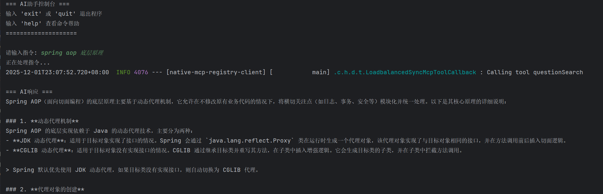

# Native MCP Registry Example

# [中文](README.md) | [English](README_EN.md)

## Project Introduction

This is a complete example project demonstrating how to automatically register **native MCP tools** to a **service registry**. The project develops MCP tools using Spring AI's native `@Tool` annotation, and implements automatic service registration through `spring-mcp-bridge-registry-starter`, providing standard service governance capabilities for native MCP tools.

## Core Features

### 🚀 Native MCP Development
- **Annotation-driven**: Uses Spring AI's native `@Tool` annotation to define MCP tools
- **Type Safety**: Complete parameter type checking and JSON Schema generation
- **Development Experience**: Pure Java development without additional configuration conversion

### 📋 Complete Service Governance
- **Service Discovery**: MCP clients automatically discover available tool services
- **Metadata Publishing**: Publishes complete MCP tool information in service instances

### 🛠️ Out-of-the-box
- **Multi-registry Support**: Supports Eureka (default in this example), Nacos, Consul, Zookeeper
- **Unified Governance**: Unified monitoring, management and maintenance
- **Simplified Deployment**: Reduces operational complexity for rapid deployment

## Environment Requirements

### Server Requirements
- JDK 17+
- Maven 3.3+
- Spring Boot 3.x
- Service Registry (This example supports Eureka, Nacos, Consul, Zookeeper)

### Client Requirements
- JDK 17+
- Maven 3.3+
- Spring Boot 3.x
- Service Registry (Must match server configuration)

## Maven Configuration

### Server Dependencies

```xml
<dependencies>
    <!-- 🔌 ai-mcp-bridge-spring-boot-mcp-registry-starter (Core Dependency) -->
    <!-- This is the core registry dependency provided by AI MCP Bridge project, must be included -->
    <dependency>
        <groupId>io.github.xiaozhug</groupId>
        <artifactId>ai-mcp-bridge-spring-boot-mcp-registry-starter</artifactId>
    </dependency>

    <!-- 🔧 ai-mcp-bridge-spring-boot-mcp-server-expose-starter (Core Dependency) -->
    <!-- Used for automatic exposure of MCP servers, key to implementing service registration -->
    <dependency>
        <groupId>io.github.xiaozhug</groupId>
        <artifactId>ai-mcp-bridge-spring-boot-mcp-server-expose-starter</artifactId>
    </dependency>

    <dependency>
        <groupId>org.springframework.cloud</groupId>
        <artifactId>spring-cloud-starter-netflix-eureka-client</artifactId>
    </dependency>

</dependencies>
```

### Client Dependencies
```xml
<dependencies>
    <!-- 🔌 ai-mcp-bridge-spring-boot-mcp-client-starter (Core Dependency) -->
    <!-- This is the core client dependency provided by AI MCP Bridge project, must be included -->
    <dependency>
        <groupId>io.github.xiaozhug</groupId>
        <artifactId>ai-mcp-bridge-spring-boot-mcp-client-starter</artifactId>
    </dependency>

    <!-- 🔧 ai-mcp-bridge-spring-boot-mcp-registry-starter (Core Dependency) -->
    <!-- Used to support discovering MCP services from the registry -->
    <dependency>
        <groupId>io.github.xiaozhug</groupId>
        <artifactId>ai-mcp-bridge-spring-boot-mcp-registry-starter</artifactId>
    </dependency>

    <dependency>
        <groupId>org.springframework.cloud</groupId>
        <artifactId>spring-cloud-starter-netflix-eureka-client</artifactId>
    </dependency>

</dependencies>
```

## Quick Start

### Server Configuration and Startup

1. **Configure application.yaml**

Add configuration in the server's `application.yaml`:

```yaml
server:
  port: 8081

spring:
  application:
    name: native-mcp-registry-server

eureka:
  client:
    service-url:
      defaultZone: http://127.0.0.1:12345/eureka/
  instance:
    instance-id: ${spring.application.name}:${random.int}


# MianshiyaService MCP tool API endpoint configuration
endpoint:
  mianshiya:
    searchQuestion: https://api.mianshiya.com/api/question/mcp/search
    resultLink: https://www.mianshiya.com/question/%s
```

2. **Define Native MCP Tools**

Create MCP tools using Spring AI's native `@Tool` annotation: [MianshiyaService.java](native-mcp-registry-server%2Fsrc%2Fmain%2Fjava%2Fio%2Fxiaozhug%2Fdemo%2Fnativeregistry%2Fmcpserver%2Fservice%2FMianshiyaService.java)

3. **Start the Service**

### Client Configuration and Usage

1. **Configure application.yaml**

Add core configuration in the client's `application.yaml`:

```yaml
spring:
  application:
    name: native-mcp-registry-client
  ai:
    openai:
      api-key: your-api-key
      chat:
        options:
          model: your-model-name
      base-url: your-openai-base-url

  cloud:
    # spring-mcp-bridge-client-starter discovery method (core configuration)
    discovery:
      fetch:
        enabled: true

eureka:
  client:
    service-url:
      defaultZone: http://127.0.0.1:12345/eureka/
  instance:
    instance-id: ${spring.application.name}:${random.int}
```

2. **Use Registry-Discovered MCP Client [NativeMcpRegistryClientApplication.java](native-mcp-registry-client%2Fsrc%2Fmain%2Fjava%2Fio%2Fxiaozhug%2Fdemo%2Fnativeregistry%2FNativeMcpRegistryClientApplication.java)**

## Automatic Registration Mechanism

### 🔄 Registration Process

1. **Tool Definition**: Define native MCP tools using `@Tool` annotation
2. **Service Startup**: Automatically detect registry when application starts
3. **Tool Registration**: Register MCP tool information to service instance metadata

## Verification Results

### ✅ Service Registration Verification

After successful startup, you can see in the Eureka console:

- **Service Name**: NATIVE-MCP-REGISTRY-SERVER
- **Instance Status**: UP
- **Metadata contains MCP-related information**

### ✅ MCP Tool Metadata Verification

You can view detailed service instance metadata by accessing `http://[eureka-server-address]:[port]/eureka/apps`:

**Key Metadata Fields**:

```xml
<mcp-server-0>eyJ0eXBlIjoiTUNQX0ZJTEUiLCJzZXJ2aWNlTmFtZSI6bnVsbCwiaW5zdGFuY2VJZCI6bnVsbCwidXJsIjpudWxsLCJ0b29scyI6bnVsbCwiaXRlbXMiOlt7... (Complete Base64-encoded MCP metadata)</mcp-server-0>
<mcp-server-size>1</mcp-server-size>
```

This metadata includes:

- Complete MCP tool definitions (Base64 encoded)
- All tool method descriptions and parameter definitions
- Input parameter JSON Schemas
- HTTP request template information

### ✅ Client Discovery Verification


## Summary

**native-mcp-registry** example project demonstrates AI MCP Bridge's support for native MCP Server Tools and service registration and discovery functionality. Through this feature, developers can directly define service interfaces that comply with MCP specifications and automatically register them to service registries, supporting dynamic discovery and invocation by clients.

This example supports multiple registries and load balancing strategies, provides flexible configuration options and complete health check mechanisms, meeting enterprise-level application requirements. At the same time, it also supports deep integration with the Spring AI ecosystem, providing powerful tool invocation capabilities for AI applications.