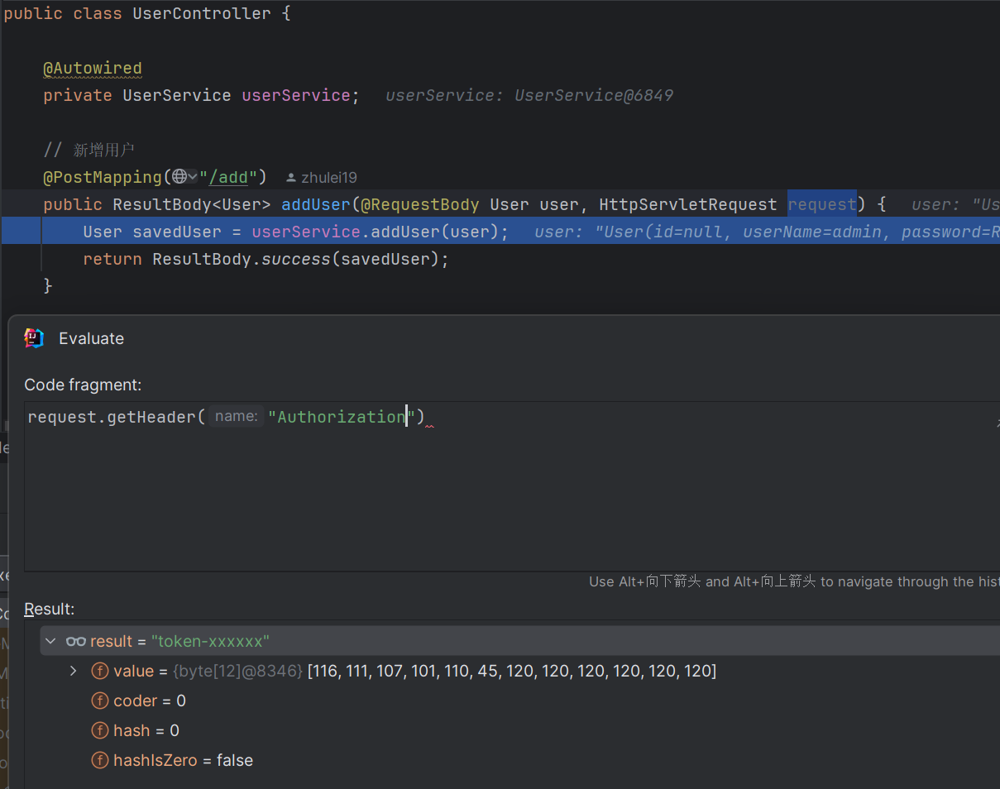

# REST to MCP HTTP Example Project

# [中文](README.md) | [English](README_EN.md)

## Project Introduction

**REST to MCP HTTP** is the core example project of AI MCP Bridge, demonstrating how to seamlessly upgrade existing Spring REST Controllers to MCP service interfaces. This example shows how to convert standard REST APIs into service interfaces compliant with MCP specifications without modifying original business code, and provide them to AI clients for invocation through HTTP protocol.

## Core Features

### 🚀 Seamless REST to MCP Conversion
- **Zero Code Intrusion**: No modification needed for existing REST Controllers; automatic conversion to MCP tools
- **Protocol Compatibility**: Based on HTTP protocol, compliant with MCP client call specifications
- **Complete Lifecycle**: Fully reuses the invocation chain of Spring Web projects, supporting interceptors, filters, etc.

## Dependencies Description

### 📦 [metadata-compile](..%2Fmetadata-compile) (Shared by demo projects)

**Important Note**: This dependency is only used for code sharing between demo projects. In actual projects, you do not need to depend on this module.

- **Demonstration Purpose**: To avoid duplicating the same UserController code across multiple demo projects
- **Actual Usage**: In your own projects, you can directly configure the MCP annotation processor to generate metadata for your own REST Controllers
- **Generation Principle**: Automatically generates metadata by analyzing your REST Controllers through the Maven compiler plugin

### Server Dependencies

**server/pom.xml**:
```xml
<dependencies>
    <dependency>
        <groupId>io.github.xiaozhug</groupId>
        <artifactId>metadata-compile-jdk8</artifactId>
    </dependency>

    <dependency>
        <groupId>io.github.xiaozhug</groupId>
        <artifactId>ai-mcp-bridge-spring-boot-mcp-file-expose-starter</artifactId>
    </dependency>
</dependencies>
```

### Client Dependencies

**client/pom.xml**:
```xml
<dependencies>
    <!-- 🔌 ai-mcp-bridge-spring-boot-mcp-client-starter (Core Dependency) -->
    <!-- This is the core client dependency provided by AI MCP Bridge project, must be included -->
    <dependency>
        <groupId>io.github.xiaozhug</groupId>
        <artifactId>ai-mcp-bridge-spring-boot-mcp-client-starter</artifactId>
    </dependency>
</dependencies>
```

## Quick Start

### Environment Requirements

- **Server**: JDK 8 or JDK 17 + Spring Boot 2.x or 3.x
- **Client**: JDK 17 + Spring Boot 3.x
- Maven 3.3+

### Server Configuration
**REST Controller is already included in [metadata-compile](..%2Fmetadata-compile) dependency, no need to write separately**

### Client Configuration and Usage

1. **Configure application.yml**

Add core configuration in the client's `application.yml`:

```yml
# ai-mcp-bridge-spring-boot-mcp-client-starter HTTP method
spring:
  mcp:
    fetch:
      http:
        enabled: true
        connections:
          server1: http://localhost:8081
```

2. **Client Main Program Example [RestToMcpHttpClientApplication.java](rest-to-mcp-http-client%2Fsrc%2Fmain%2Fjava%2Fio%2Fxiaozhug%2Fdemo%2Fresttomcphttp%2FRestToMcpHttpClientApplication.java)**

## Function Verification

### Verification Methods

1. **Start the server**
2. Access the metadata endpoint to view generated MCP metadata
3. Use the client to call the converted MCP interfaces
4. Verify if the call results meet expectations

### Verification Content



## Summary

**REST to MCP HTTP** example project demonstrates the core functionality of AI MCP Bridge: seamlessly converting REST Controllers to MCP service interfaces. Through this functionality, developers can quickly upgrade existing Spring Web projects to support AI-invoked MCP services without code modifications.

This example provides complete server and client implementations, supports MCP invocation through HTTP protocol, and integrates with Spring AI to directly work with AI models. Through simple annotation configuration, REST APIs can be converted to MCP services, providing powerful tool invocation capabilities for AI applications.