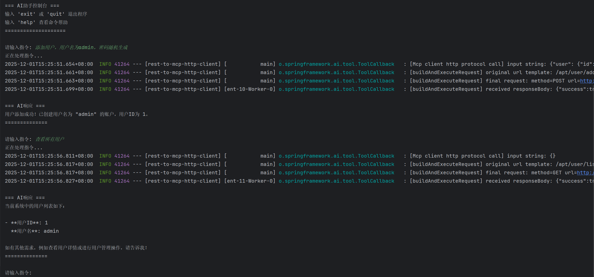
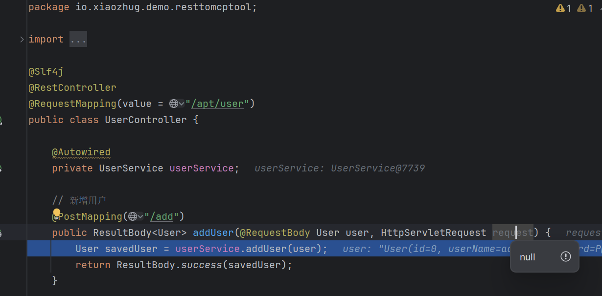

# REST to MCP Tool Example Project

# [中文](README.md) | [English](README_EN.md)

## Project Introduction

**REST to MCP Tool** is an important example project of AI MCP Bridge, demonstrating how to seamlessly adapt existing Spring REST Controllers into **Spring AI MCP Server Tools**.
This example automatically converts compile-time generated MCP metadata into standard Spring AI Tool definitions through `ai-mcp-bridge-spring-boot-mcp-adapter-tool-starter`, enabling your REST APIs to be directly called by Spring AI MCP Clients.

## Core Features

### 🚀 Seamless REST to Spring AI Tool Conversion
- **Zero Code Intrusion**: No modification needed for existing REST Controllers; automatic registration as Spring AI Tools
- **Native Integration**: Deep integration with Spring AI ecosystem, supporting standard MCP protocol
- **Type Safety**: Complete type-safe invocation based on JSON Schema

### 📋 Automated Tool Registration
- **Metadata Auto-discovery**: Automatically loads compile-time generated MCP metadata
- **ToolCallback Auto-creation**: Creates corresponding ToolCallback for each REST method
- **Spring AI Native Support**: Fully compatible with Spring AI Tool invocation mechanism

### 🛠️ Dual Protocol Support
- **MCP Native Protocol**: Provides standard MCP protocol support through Spring AI MCP Server
- **HTTP Protocol**: Maintains original REST interface's HTTP calling capability

## Dependencies Description

### 📦 [metadata-compile](..%2Fmetadata-compile) (Shared by demo projects)

**Important Note**: This dependency is only used for code sharing between demo projects. In actual projects, you do not need to depend on this module.

- **Demonstration Purpose**: To avoid duplicating the same UserController code across multiple demo projects
- **Actual Usage**: In your own projects, you can directly configure the MCP annotation processor to generate metadata for your own REST Controllers
- **Generation Principle**: Automatically generates metadata by analyzing your REST Controllers through the Maven compiler plugin

### 📦 Server Core Dependencies

**pom.xml**:
```xml
<dependencies>
    <dependency>
        <groupId>io.github.xiaozhug</groupId>
        <artifactId>metadata-compile-jdk17</artifactId>
    </dependency>

    <!-- 🔌 ai-mcp-bridge-spring-boot-mcp-adapter-tool-starter (Core Dependency) -->
    <!-- This is the core adapter dependency provided by AI MCP Bridge project, must be included -->
    <dependency>
        <groupId>io.xiaozhug</groupId>
        <artifactId>ai-mcp-bridge-spring-boot-mcp-adapter-tool-starter</artifactId>
    </dependency>
</dependencies>
```

### 📦 Client Dependencies

**Standard MCP Client**:
```xml
<dependencies>
    <dependency>
        <groupId>org.springframework.ai</groupId>
        <artifactId>spring-ai-starter-model-openai</artifactId>
    </dependency>

    <!-- choose either web or webflux -->
    <dependency>
        <groupId>org.springframework.boot</groupId>
        <artifactId>spring-boot-starter-web</artifactId>
    </dependency>

    <dependency>
        <groupId>org.springframework.ai</groupId>
        <artifactId>spring-ai-starter-mcp-client</artifactId>
    </dependency>
</dependencies>
```

## Environment Requirements

- **Server**: JDK 17 + Spring Boot 3.x
- **Client**: JDK 17 + Spring Boot 3.x
- Maven 3.3+

## Automatic Configuration Mechanism

### 🔄 Tool Registration Process

1. **Compile-time Generation**: MCP annotation processor analyzes REST Controller to generate `mcp-metadata.json`
2. **Startup-time Scanning**: `McpMetadataToolCallbackProvider` automatically scans metadata files
3. **Tool Creation**: Creates corresponding `ToolCallback` for each REST method
4. **Spring AI Registration**: Registers to Spring AI context through `ToolCallbackProvider` interface

## Quick Start

### Server Configuration
**REST Controller is already included in [metadata-compile](..%2Fmetadata-compile) dependency, no need to write separately**

### Client Configuration and Usage

1. **Configure application.yaml**

Add core configuration in the client's `application.yaml`:

```yaml
# Spring AI native configuration
spring:
  ai:
    mcp:
      client:
        sse:
          connections:
            server1:
              url: http://localhost:8081
```

2. **Client Main Program Example [RestToMcpToolServerApplication.java](rest-to-mcp-tool-server%2Fsrc%2Fmain%2Fjava%2Fio%2Fxiaozhug%2Fdemo%2Fresttomcptool%2FRestToMcpToolServerApplication.java)**

## Function Verification

### Verification Methods

1. **Start the server**
2. Use Spring AI MCP Client to call the converted MCP Tool
3. Verify if the call results meet expectations

### Verification Content



## Comparison with REST to MCP HTTP

### Advantages of REST to MCP Tool
- **Client Versatility**: Clients can use official MCP Client (supports multiple programming languages)
- **Spring AI Native Integration**: Deep integration with Spring AI ecosystem
- **Automatic Tool Registration**: No manual configuration needed, automatically registers as Spring AI Tools

### Limitations of REST to MCP Tool
- **Parameter Compatibility**: Spring Web framework-specific parameter types (such as `HttpServletRequest`) are not friendly for large model generated calls
- **Higher Environment Requirements**: Only supports JDK 17 + Spring Boot 3.x

### Advantages of REST to MCP HTTP
- **Parameter Friendliness**: All parameters can be understood and generated friendly by large models
- **Better Environment Compatibility**: Server supports JDK 8 or JDK 17

### Limitations of REST to MCP HTTP
- **Client Dependency**: Requires using `ai-mcp-bridge-spring-boot-mcp-client-starter` dependency provided by this project

## How to Choose

- If your project environment is JDK 17 + Spring Boot 3.x, and you want to use official MCP Client, choose **REST to MCP Tool**
- If your project needs to support JDK 8, or REST Controller contains many Spring Web-specific parameters, choose **REST to MCP HTTP**

## Summary

**REST to MCP Tool** example project demonstrates the powerful functionality of AI MCP Bridge: seamlessly converting REST Controllers into Spring AI MCP Server Tools. Through this functionality, developers can quickly upgrade existing Spring Web projects to support AI-invoked MCP services without code modifications.